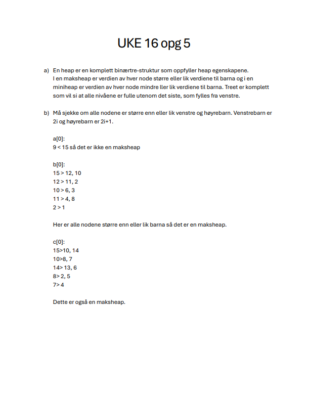
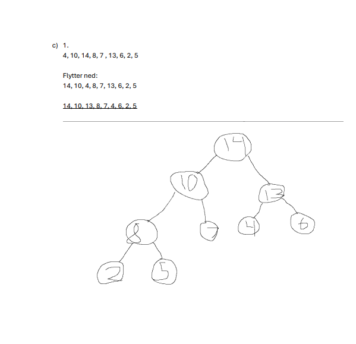
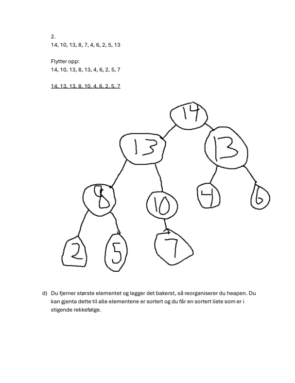
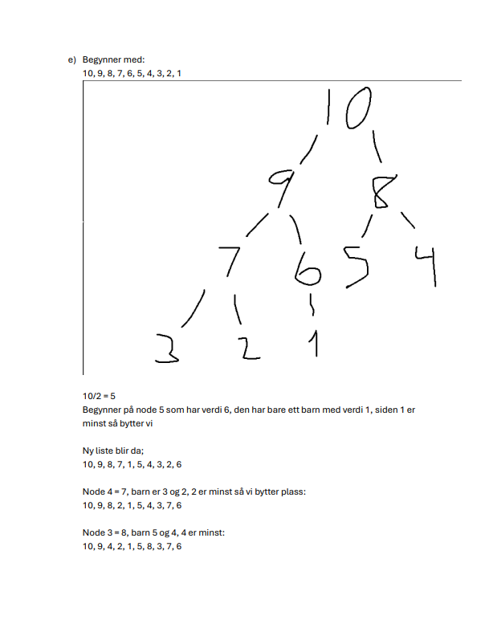
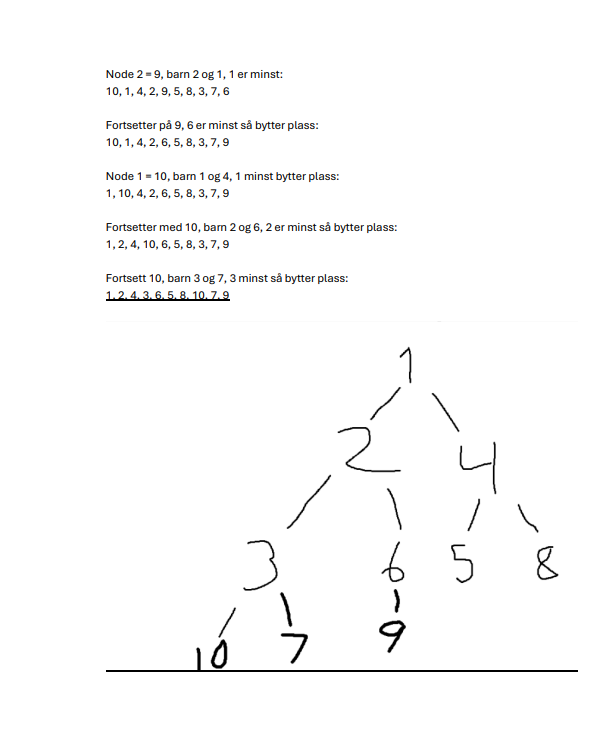

# DAT102-o5


## Oppgave u16o2

### a)

Metoden går alltid til venstre subtree, sjekker noden, går alltid til høyre subtree.
Så den gjør en inorden-traversering av hele treet uansett hva min og maks er.
I et binært søketre så er alle verdier i venstre subtree mindre enn noden og alle verdier i høyre subtre er strørre. 
Hvis en node har en verdi som er mindre enn min så vil hele venstre subtre og inneholde verdier som er for små
så de trengs derfor ikke å traverseres, samme gjelder for høyre. Metoden tenker ikke på dette og er derfor ueffektiv.

### b)

```Java
public class OPG2 {

    //b)

    private void skrivVerdierRek(BinaerTreNode<T> t, T min, T maks) {
        if (t == null) return;

        int cmpMin = t.getElement().compareTo(min);
        int cmpMax = t.getElement().compareTo(maks);

        if (cmpMin > 0) {
            skrivVerdierRek(t.getVenstre(), min, maks);
        }

        if (cmpMin >= 0 && cmpMax <= 0) {
            System.out.print(t.getElement() + " ");
        }

        if (cmpMax < 0) {
            skrivVerdierRek(t.getHogre(), min, maks);
        }
    }
}

```

## Uke 16 Oppgave 3

### a) Modifisering av `BinaerTreNode`

Vi legger til variabelen `hogdeU` og oppdaterer konstruktøren. En ny node som legges til som et blad, vil alltid ha høyde 1.

```java
public class BinaerTreNode<T extends Comparable<? super T>> {
    private T element;
    private BinaerTreNode<T> venstre;
    private BinaerTreNode<T> hoyre;
    private int hogdeU; // Den nye variabelen

    public BinaerTreNode(T element) {
        this.element = element;
        this.venstre = null;
        this.hoyre = null;
        this.hogdeU = 1; // En ny node har høyde 1
    }

    public int getHogdeU() {
        return hogdeU;
    }

    public void setHogdeU(int hogdeU) {
        this.hogdeU = hogdeU;
    }
}
```

### b) Sjekke om treet er balansert

For at et tre skal være balansert, må differansen mellom venstre og høyre undertre være høyst 1 ($\left| h_L - h_R \right| \le 1$), og dette må gjelde for **alle** noder i treet.

```java
public boolean erBalansert(BinaerTreNode<T> p) {
    if (p == null) {
        return true; // Et tomt tre er balansert
    }

    // Finn høyden på venstre og høyre undertre
    int hV = (p.getVenstre() != null) ? p.getVenstre().getHogdeU() : 0;
    int hH = (p.getHoyre() != null) ? p.getHoyre().getHogdeU() : 0;

    // Sjekk balanse-faktoren for denne noden
    if (Math.abs(hV - hH) > 1) {
        return false;
    }

    // Sjekk rekursivt nedover i treet
    return erBalansert(p.getVenstre()) && erBalansert(p.getHoyre());
}
```

### c) Frivillig: Oppdatere `hogdeU` i `leggTil`

Når vi legger til en node rekursivt, vil vi oppdatere høyden på vei "opp" igjen fra rekursjonen. Høyden til en node er alltid $1 + \max(\text{høyde venstre}, \text{høyde høyre})$.

```java
public BinaerTreNode<T> leggTil(BinaerTreNode<T> p, T element) {
    if (p == null) {
        return new BinaerTreNode<>(element);
    }

    int sammenlign = element.compareTo(p.getElement());

    if (sammenlign < 0) {
        p.setVenstre(leggTil(p.getVenstre(), element));
    } else if (sammenlign > 0) {
        p.setHoyre(leggTil(p.getHoyre(), element));
    }

    // Oppdater hogdeU for den aktuelle noden etter at barnet er lagt til
    oppdaterHogde(p);

    return p;
}

private void oppdaterHogde(BinaerTreNode<T> p) {
    int hV = (p.getVenstre() != null) ? p.getVenstre().getHogdeU() : 0;
    int hH = (p.getHoyre() != null) ? p.getHoyre().getHogdeU() : 0;
    
    p.setHogdeU(1 + Math.max(hV, hH));
}
```

### Hvorfor er dette effektivt?

Uten variabelen `hogdeU` måtte `erBalansert` kalt en `finnHoyde`-metode som besøker alle noder under seg. Det ville ført til en tidskompleksitet på $O(n^2)$ i verste fall. Med variabelen lagret, utfører vi sjekken i $O(n)$ fordi hver høyde-oppslag nå skjer i konstant tid, $O(1)$.







## Uke 17/18 Oppgave 1

### 1. Utvalgssortering (Selection Sort)

**Modifikasjon:** Selection sort fungerer ved å finne det minste elementet og flytte det til starten, for så å gjenta prosessen for resten av listen. For å finne de $k$ minste, trenger vi bare å kjøre den ytre løkken **$k$ ganger** i stedet for $n$ ganger.

* **Prosess:** Finn minste element (scan $n$ elementer), finn nest minste (scan $n-1$ elementer), og fortsett til du har de $k$ minste.
* **Tidskompleksitet:** Vi gjør $k$ gjennomganger, der hver gjennomgang i snitt tar $O(n)$ tid.
  * **Orden:** $O(n \cdot k)$

---

### 2. Sortering ved innsetting (Insertion Sort)

**Modifikasjon:**
Vi kan vedlikeholde en sortert liste over de minste elementene vi har sett så langt. For hvert nye element i den usorterte tabellen, sjekker vi om det er mindre enn det største elementet i vår "topp-k"-liste.

* **Prosess:** For hvert av de resterende $n-k$ elementene, må vi potensielt sette det inn i vår sorterte del på $k$ elementer.
* **Tidskompleksitet:** Å sette inn i en sortert liste på $k$ elementer tar $O(k)$ tid. Dette gjør vi for $n$ elementer.
  * **Orden:** $O(n \cdot k)$
  * *Merk:* Hvis $k$ er veldig liten, er dette effektivt, men hvis $k \approx n$, faller den tilbake til $O(n^2)$.

---

### 3. Haugsortering (Heap Sort)

Her finnes det to hovedmåter å løse det på, avhengig av om $k$ er liten eller stor.

**Metode A: Min-Heap (Best når $k$ er stor eller nær $n$)**

1. Bygg en **Min-Heap** av alle $n$ elementene: $O(n)$.
2. Utfør `extract-min` operasjonen **$k$ ganger**: $O(k \log n)$.

* **Total Orden:** $O(n + k \log n)$

**Metode B: Maks-Heap (Best når $k$ er liten)**

1. Bygg en **Maks-Heap** med de første $k$ elementene: $O(k)$.
2. For hvert av de resterende $n-k$ elementene: Hvis elementet er mindre enn roten (maks-elementet), erstatt roten og kjør `heapify`: $O((n-k) \log k)$.

* **Total Orden:** $O(k + (n-k) \log k)$, som forenkles til $O(n \log k)$.

---

#### Oppsummering av tidskompleksitet

| Algoritme | Modifisert Orden | Kommentar |
| :--- | :--- | :--- |
| **Selection Sort** | $O(nk)$ | Svært effektiv hvis $k$ er en liten konstant. |
| **Insertion Sort** | $O(nk)$ | Ligner selection sort i denne sammenhengen. |
| **Heap Sort** | $O(n \log k)$ eller $O(n + k \log n)$ | Den mest robuste metoden for store datasett. |

**Viktig observasjon:** Hvis $k$ er veldig liten (f.eks. vi skal bare ha de 3 minste), er $O(nk)$ i praksis $O(n)$, som er lineært og veldig raskt. Hvis $k$ nærmer seg $n$, vil de kvadratiske algoritmene ($O(n^2)$) bli svært trege sammenlignet med Heap Sort ($O(n \log n)$).

## Oppgave 2

### a)

Et binært søketre er fullstendig balansert når hver node i treet har to subtrær med lik høyde. For at et binært søketre skal være fullstendig balansert må treet være fullt og komplett. For binære trær som ikke er fulle og komplette vil et tre være høydebalansert hvis hvert subtre i hver node har ikke har en høydedifferanse som er større enn 1

### b)


### c)


### d)

Det er viktig at binære søketrær er balanserte slik at algoritmer som går gjennom treet beholder tidskompleksitet på O(log n)

## Uke 17/18 Oppgave 3

### a) Innsetting i 2-3 tre

Et 2-3 tre er et balansert søketre der hver node kan ha enten ett eller to elementer (2-node eller 3-node). Når en node blir "full" (får tre elementer), splittes den, og det midterste elementet dyttes opp.

**1. Sett inn 20:**
Treet starter med en enkelt node.
`[20]`

**2. Sett inn 50:**
Noden har plass til ett element til.
`[20, 50]`

**3. Sett inn 30:**
Noden blir midlertidig `[20, 30, 50]`. Den må splittes. 30 går opp som rot.

```text
    [30]
   /    \
[20]    [50]
```

**4. Sett inn 5:**
5 legges inn i løvnode til venstre.

```text
      [30]
     /    \
[5, 20]   [50]
```

**5. Sett inn 40:**
40 legges inn i løvnode til høyre.

```text
      [30]
     /    \
[5, 20]  [40, 50]
```

**6. Sett inn 80:**

Løvnoden til høyre blir `[40, 50, 80]`. Den splittes, og 50 dyttes opp til roten.

```text
      [30, 50]
     /    |    \
 [5, 20] [40]  [80]
```

**7. Sett inn 17:**
17 legges inn i løvnode helt til venstre. Noden blir `[5, 17, 20]`. Den splittes, og 17 dyttes opp. Dette gjør at roten blir `[17, 30, 50]`, som igjen må splittes. 30 blir ny rot.

**Endelig tre:**

```text
          [30]
        /      \
    [17]        [50]
   /    \      /    \
 [5]    [20] [40]   [80]
```

---

### b) Sann eller usann?

Her er vurderingen av påstandene om 2-3 trær:

| Nr. | Påstand | Status | Forklaring |
| :--- | :--- | :--- | :--- |
| **1** | Ingen noder i treet har nøyaktig ett barn. | **Sann** | En 2-node har 2 barn, og en 3-node har 3 barn. Løvnoder har 0 barn. Ingen noder kan ha bare 1 barn. |
| **2** | Treet inneholder maksimalt en 3-node. | **Usann** | Et 2-3 tre kan ha så mange 3-noder som det er plass til; det er ingen begrensning på antallet. |
| **3** | Alle blad er på samme nivå. | **Sann** | Dette er selve definisjonen på balansen i et 2-3 tre; treet vokser alltid i høyden fra roten og ned, slik at alle blader forblir på samme nivå. |
| **4** | Dersom treet bare inneholder 2-noder, så vil det tilsvare et balansert BS-tre. | **Sann** | Et 2-3 tre med bare 2-noder er et perfekt balansert binært søketre (hvor alle nivåer er fulle). |
| **5** | Alle 3-noder må være blad. | **Usann** | 3-noder kan være både rot-noder og interne noder, så lenge de har 3 barn hver. |

### oppgave 4


#### d) Modifikasjon for å oppdage sykluser
En topologisk ordning eksisterer bare i en DAG (Directed Acyclic Graph). Hvis grafen har en syklus, vil vi på et tidspunkt sitte igjen med noder som alle har en inn-grad > 0. Modifikasjon:
Hold telling på hvor mange noder som blir lagt til i den topologiske listen.
Hvis algoritmen stopper og antall noder i listen er mindre enn det totale antallet noder i grafen, betyr det at grafen inneholder en syklus. Gi melding: "Ingen topologisk ordning eksisterer".

#### e) Dijkstras algoritme: Billigste sti fra A til H
| Steg | Besøkt node | Distanse til noder (oppdatert) |
| :--- | :--- | :--- |
| 1 | A | A(0), B(2), G(5), F(9) |
| 2 | B | B(2), G(5), C(6), F(9) |
| 3 | G | G(5), C(6), I(7), H(10), F(9) |
| 4 | C | C(6), I(7), D(8), H(10) (ingen endring på H via C da 6+5=11) |
| 5 | I | I(7), F(8), E(10), H(11) (ingen endring på H) |
| 6 | F | F(8), E(10) |
| 7 | D | D(8), H(9), E(9) |
| 8 | H | H(9) |
Analyse av stier til H:
A -> G -> H: $5 + 5 = 10$
A -> B -> G -> H: $2 + 6 + 5 = 13$
A -> G -> I -> H: $5 + 2 + 4 = 11$
A -> B -> C -> D -> H: $2 + 4 + 2 + 1 = 9$

Billigste sti: A → B → C → D → H
Total kostnad: 9